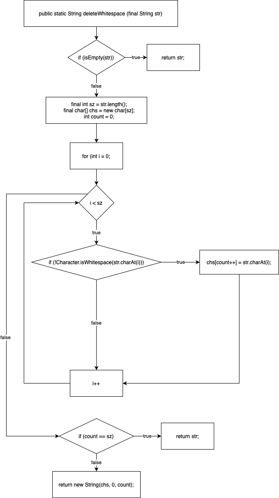
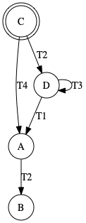
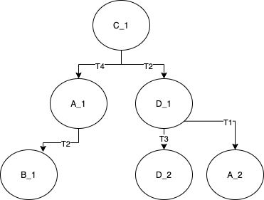

# 2020 Midterm preparation - Answers


--- 

Method under test `deleteWhitespace(final String str)` from class `org.apache.commons.lang3.StringUtils`.

Source code of the entire class: https://github.com/apache/commons-lang/tree/e0b474c0d015f89a52c4cf8866fa157dd89e7d1c/src/main/java/org/apache/commons/lang3/StringUtils.java#L1564

Snippet of the method you should test:

```java
/**
 * <p>Deletes all whitespaces from a String as defined by
 * {@link Character#isWhitespace(char)}.</p>
 *
 *
 * @param str  the String to delete whitespace from, may be null
 * @return the String without whitespaces, {@code null} if null String input
 */
public static String deleteWhitespace(final String str) {
    if (isEmpty(str)) {
        return str;
    }
    final int sz = str.length();
    final char[] chs = new char[sz];
    int count = 0;
    for (int i = 0; i < sz; i++) {
        if (!Character.isWhitespace(str.charAt(i))) {
            chs[count++] = str.charAt(i);
        }
    }
    if (count == sz) {
        return str;
    }
    return new String(chs, 0, count);
}

``` 

---

## Exercise: Domain testing

Variables:

* We see a single input variable, `str` (String).
* The program outputs a String.

Dependency among variables:

* No dependencies (just a single input variable).

Equivalence and boundary analysis:

* Variable str: 
    * null
    * empty
    * with a single whitespace
    * with many whitespaces
    * without whitespace

* Boundaries: Boundaries between partitions happen when the string goes from no whitespaces, to a single whitespace, to many whitespaces. 

(Note that others can see cases, such as whitespaces at the beginning or whitespaces at end. We do not see a need for this, given the implementation. Nevertheless, as a black-box tester, these tests are totally valid!)

Strategy: The number of partitions is manageable. Let's write tests to all of them.

Test cases:

* T1 null string = (null string) -> (null)
* T2 empty string = "" -> ""
* T3 no whitespace = "abc" -> "abc"
* T4 single whitespace = "abc " -> "abc"
* T5 multiple whitespaces = " a b c" -> "abc"

## Exercise: Control-flow graph



_Note: Considering the `for(int i = 0)` as part of the previous block is also an acceptable solution._

## Exercise: Structural testing

The tests we devised in the domain testing already achieve 100% full condition coverage.

From structural testing, we note that the `if (count == sz)` is not really needed. It seems to be there to avoid the allocation of a new string in the memory (i.e., if the string has no whitespaces, it just returns the same string). While not an explicit requirement, it was already covered by the "no whitespace" partition. To make the tests to capture such implicit requirement, we added an assertion that checks whether the String instance returned by the `deleteWhitespace()` is the same as the one provided in the input (i.e., `assertSame`).

_(Some of you might also consider exercising the for loop 0, 1, and multiple times, for a stronger coverage. Although the exercise did not really ask for loop boundary adequacy, it is an acceptable answer too.)_

## Exercise: JUnit code

```java
import org.apache.commons.lang3.StringUtils;
import org.junit.jupiter.params.ParameterizedTest;
import org.junit.jupiter.params.provider.Arguments;
import org.junit.jupiter.params.provider.MethodSource;

import java.util.stream.Stream;

import static org.assertj.core.api.Assertions.assertThat;

// UTest is the name required by WebLab
// otherwise, a more elegant name would be better.
public class UTest {

    @ParameterizedTest(name = "{0}")
    @MethodSource("generator")
    void deleteWhitespace(String description, String str, String expectedResult) {
        assertThat(StringUtils.deleteWhitespace(str)).isEqualTo(expectedResult);
    }

    private static Stream<Arguments> generator() {
        Arguments tc1 = Arguments.of("null", null, null);
        Arguments tc2 = Arguments.of("empty", "", "");
        Arguments tc3 = Arguments.of("no withspace", "abc", "abc");
        Arguments tc4 = Arguments.of("single withspace", "abc ", "abc");
        Arguments tc5 = Arguments.of("with multiple withspaces", " a b c", "abc");

        return Stream.of(tc1, tc2, tc3, tc4, tc5);
    }

    @Test
    void keepSameReferenceIfNoWhitespaces() {
        String abc = "abc";
        assertThat(StringUtils.deleteWhitespace(abc)).isSameAs(abc);
    }
}
```

_Note that we will not judge you by your personal code style. If you opt for `@CsvSource` instead of `@MethodSource`, for example, is no problem. That being said, you should definitely avoid duplicated code, variables with unclear names, or useless code._

## Exercise: Contracts

* Pre-conditions: The requirements allow the method to receive a _null_ String. Otherwise, we could formalize _string not null_ as a pre-condition to this method.

* Post-conditions: The final string has `length==count`. That could be formalized as a post-condition.

* Class-invariants: No class invariants. This is a static method. 


Note that you might see other (maybe stronger) post-conditions. For example:

* The result should not have any whitespaces. Implementation: `assert !result.contains(" ")`. 
* The returned String is smaller or equal to the original String. Implementation: `assert count <= sz;`
* It contains all the characters in the original string that are not white spaces.

These are definitely all valid post-conditions. 

(In the examples above, as a developer, an important consideration in applying DbC is whether they are "too redundant" with the test cases.)

## Picking a state machine


---

- The machine begins in state **C**.

- When the machine is at state **A** and event **T2** is invoked, then the machine proceeds to state **B**.

- When the machine is at state **C** and reaction **T2** occurs, then the machine proceeds to state **D**.

- When the machine is at state **C** and operation **T4** is triggered, then the machine enters state **A**.

- When the machine is at state **D** and event **T3** is invoked, then the machine enters state **D**.

- When the machine is in state **D** and reaction **T1** is invoked, then the machine enters state **A**.


---


## Exercise: Drawing a state machine



 
Note that we use double lines to represent the initial state. You could have used the UML way of doing it (dark circle pointing to the initial state). We will accept both styles.

## Exercise: Transition tree



## Exercise: Sneaky paths

Let's draw the transition table:

|   | T1 | T2 | T3 | T4 |
|---|----|----|----|----|
| A | -  | B  | -  | -  |
| B | -  | -  | -  | -  |
| C | -  | D  | -  | A  |
| D | A  | -  | D  | -  |

Sneaky paths are all the empty cells (11 sneaky paths):

* for state A: T1, T3, T4
* for state B: T1, T2, T3, T4
* for state C: T1, T3
* for state D: T2, T4


