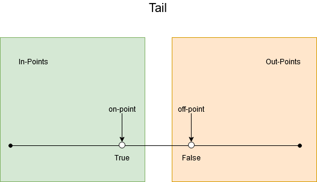
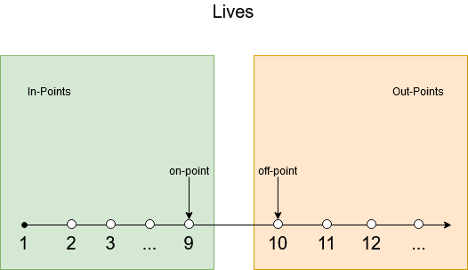
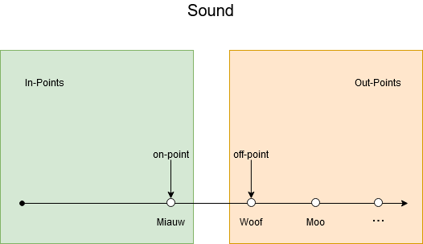
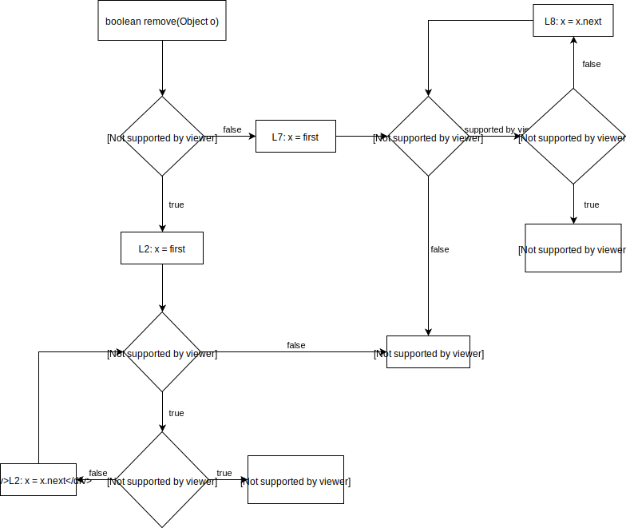
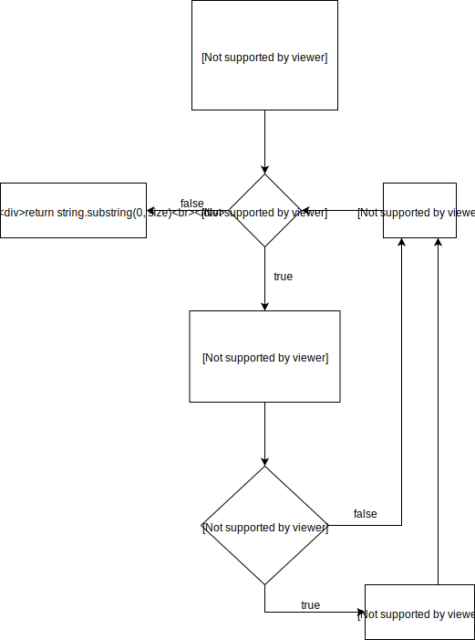
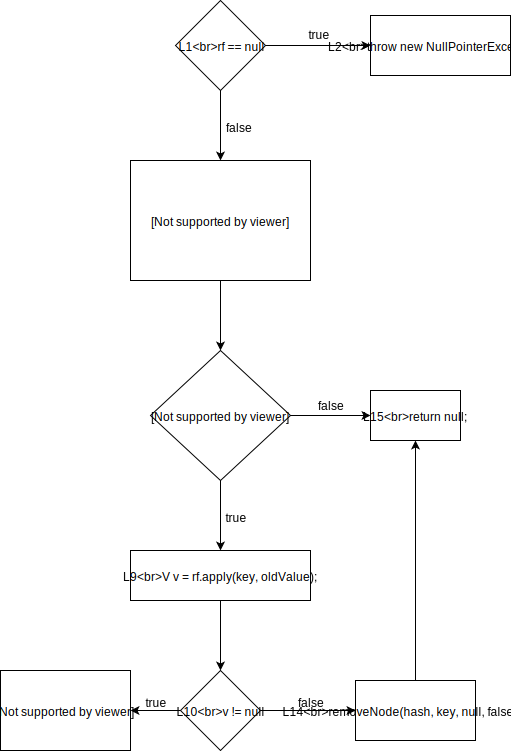
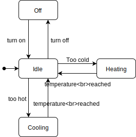
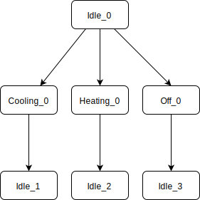
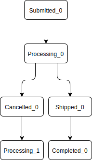

# Answers to the exercises

## Principles of software testing

**Exercise 1**

1. Failure, the user notices the system/program behaving incorrectly.
2. Fault, this is a problem in the code, that is causing a failure in this case.
3. Error, the human mistake that created the fault.

**Exercise 2**

The absence-of-errors fallacy.
While the software does not have a lot of bugs, it is not giving the users what they want.
In this case the verification was good, but they need work on the validation.

**Exercise 3**

Exhaustive testing is impossible.

**Exercise 4**

Test early, although an important principle, is definitely not related to the problem of only doing unit tests. All others help people in understanding that variation, different types of testing, is important.


## Introduction to software testing automation

Writing tests is fun, isn't it?


## Specification-based testing


**Exercise 1**

A group of inputs that all make a method behave in the same way.


**Exercise 2**

We use the concept of equivalence partitioning to determine which tests can be removed.
According to equivalence partitioning we only need to test one test case in a certain partition.

We can group the tests cases in their partitions:

- Divisible by 3 and 5: T1, T2
- Divisible by just 3 (not by 5): T4
- Divisible by just 5 (not by 3): T5
- Not divisible by 3 or 5: T3

Only the partition where the number is divisible by both 3 and 5 has two tests.
Therefore we can only remove T1 or T2.


**Exercise 3**

Following the category partition method:

1. Two parameters: key and value
2. The execution of the program does not depend on the value; it always inserts it into the map.
We can define different characteristics of the key:
      - The key can already be present in the map or not.
      - The key can be null.
3. The requirements did not give a lot of parameters and/or characteristics, so we do not have to add constraints.
4. The combinations are each of the possibilities for the key with any value, as the programs execution does not depend on the value.
We end up with three partitions:
      - New key
      - Existing key
      - null key


**Exercise 4**

There are no right or wrong answers to this exercise.
It services to show that a lot of decisions that we make are based on what we know about the system (or, in this case, what we assume about the system).
But, when context kicks in, there might be more possible invalid test cases then just the cases in the boundaries.

Whatever decisions you as a tester make regarding specific invalid test cases, it is important to justify those decisions.
For example:
* Do we feel the need of testing negative numbers separately from positive numbers? From the specification, there's no reason to do so.
If you look at the source code (supposing you have access to the source code, does it make you feel like this test is needed?
* Do we feel the need of testing trailing zeroes? Maybe the user inputs a string which is converted later... Then, testing might be important.
* Do we feel the need to test extreme numbers, like Integer.MAX_VALUE or even passing a long int or float there?
* Do we feel the need to test with a string consisting of only 1 letter, or maybe more than 2 letters?
If there's no input validation, unintended behaviour might be right around the corner
* Do we feel the need to test lowercase letters? Maybe the program can't distinguish between lower- and uppercase letters.

Examples of possible invalid partitions:
1. [Integer.MIN_VALUE, 999]
2. [4001, Integer.MAX_VALUE]
3. [AA, B]
4. [N, Z]
5. [0000, 0999]
6. [AAA, ZZZ]


**Exercise 5**

* P1: Element not present in the set
* P2: Element already present in the set
* P3: NULL element.

The specification clearly makes the three different cases of the correct answer explicit.


**Exercise 6**

Option 4 is the incorrect one.
This is a functional testing technique. No need for source code.


**Exercise 7**

Possible actions:

1. We should treat file names 'no-filename with this name' and 'omitted' as exceptional, and thus, test them just once.
2. We should treat pattern size 'empty' as exceptional, and thus, test it just once.
3. We should constrain the options in the 'occurrences in a single line' category to happen only if 'occurrences in the file' are either exactly one or more than one. It does not make sense to have none occurrences in a file and one pattern in a line.
4. We should treat 'pattern is improperly quoted' as exceptional, and thus, test it just once.

**Exercise 8**

This focus of this exercise is for you to see that the internal state of the object should also be taken into account in the partitions (and not only the direct input variables).

Input parameter e:
* P1: Element not present in the set
* P2: Element already present in the set
* P3: NULL element.

Set is full?  (`isFull` comes from the state of the class)
* isFull == true
* isFull == false

With the categories and partitions in hands, we can constrain the `isFull == true` and test it only once (i.e., without combining with other classes).

We then combine them all and end up with four tests:

* T1: isFull returns false, e: Element not present in the set
* T2: isFull returns false, e: Element present in the set
* T3: isFull returns false, e: Null element
* T4: isFull returns true, e: Element not present in the set


## Boundary testing

**Exercise 1**

The on-point is the value in the conditions: `half`.

When `i` equals `half` the condition is false.
Then the off-point makes the condition true and is as close to `half` as possible.
This makes the off-point `half` - 1.

The in-points are all the points that are smaller than half.
Practically they will be from 0, as that is what `i` starts with.

The out-points are the values that make the condition false: all values equal to or larger than `half`.

**Exercise 2**

The on-point is 10.
Here we are dealing with an equality; the value can both go up and down to make the condition false.
As such, we have two off-points: 9 and 11.


**Exercise 3**

The on-point can be read from the condition: 570.

The off-point should make the condition false (the on-point makes it true): 571.

An example of an in-point is 483.
Then the condition evaluates to true.

An example of an out-point, where the condition evaluates to false, is 893.


**Exercise 4**

An on-point is the (single) number on the boundary. It may or may not make the condition true. The off point is the closest number to the boundary that makes the condition to be evaluated to the opposite of the on point. Given it's an inequality, there's only a single off-point.


**Exercise 5**

on point = 1024, off point = 1025, in point = 1028, out point = 512

The on point is the number precisely in the boundary = 1024. off point is the closest number to the boundary and has the opposite result of on point. In this case, 1024 makes the condition false, so the off point should make it true. 1025. In point makes conditions true, e.g., 1028. Out point makes the condition false, e.g., 512.


**Exercise 6**

The decision consists of two conditions, so we can analyse these separately.

First note that the modulo function `%` is not a linear function, therefore there is no single on and off point.

(Graph of `f(n) = n % 3`, desmos.com)


For `n % 3 == 0` any multiple of 3 would work as an on-point.
Because we can't exhaustively test all multiples of 3, only one of them should be tested. Let's use 3 for this exercise.
There are also infinitely many off points we can pick. Choosing the respective off-points of our on-point should suffice. Off-points: 2 and 4.

Similarly to the first condition for `n % 5 == 0` we have an on-point of 5.
Now the off-points are 4 and 6.


**Exercise 7**

We should always test the behaviour of our program when any expected data actually does not exist (EXISTENCE).


**Exercise 8**
We have a lot of boundaries to test for:







To establish the needed tests in the category/partition method, we need to identify the parameters, derive the characteristics, add constraints and final make the tests.
As we last step we can identify duplicate tests and remove those.

1. Identify parameters:
  - Legs
  - Tail
  - Lives
  - Sharp nails
  - Sound
1. Derive characteristics of parameters:
  - int legs: [0,2,4,6,8,10,integer.MAX_VALUE], [1,3,5,7,9,integer.MAX_VALUE], [negative value]
  - bool tail: [true], [false]
  - int lives: [1-9], no lives, more than 10 lives
  - bool sharp nails: [true], [false]
  - string sound: ['miauw'], ['woof'], [empty]
1. Add constraints:
  - If `lives <= 0`, we can test this with just one combination.
  - If legs is an negative integer or 0, this is an exceptional case. Therefore it doesn't matter if the animal has sharp nails or not.
  - If legs is not an even integer, we can test this with just one combination.
  - If `lives >= 10`, we can test this with just one combination.
1. Test cases: Tests can be divided in 3 categories: is a cat, not a cat, exceptional cases.
  - **Cat**
    1. 2, true, 6, true, "miauws" --> cat
  - **Not a cat**
    1. 3, true, 6, true, "miauws" --> not a cat
    2. 4, false, 6, true, "miauws" --> not a cat
    3. 6, true, 11, true, "miauws" --> not a cat
    4. 8, true, 4, false, "miauws" --> not a cat
    5. 2, true, 3, true, "woof" --> not a cat
  - **Exceptional**
    1. 0, true, 2, false, "miauws" --> cat or invalid depending on the context of the program.
    2. 2, true, 11, true, "miauws" --> not a cat
    3. 3, true, 8, true, "miauws" --> not a cat
    4. 4, true, 0, true, "miauws" --> not a cat or invalid depending on the context of the program.


Note that some tests can be combined! For example:
  - TEST-1 from not a cat is the same as TEST-3 from exceptional
  - TEST-3 from not a cat is the same as TEST-2 from exceptional

So the total number of tests = 8.


## Structural testing

**Exercise 1**

Example of a test suite that achieves $$100\%$$ line coverage:

```java
@Test
public void removeNullInListTest() {
    LinkedList<Integer> list = new LinkedList<>();

    list.add(null);

    assertTrue(list.remove(null));
}

@Test
public void removeElementInListTest() {
    LinkedList<Integer> list = new LinkedList<>();

    list.add(7);

    assertTrue(list.remove(7));
}

@Test
public void removeElementNotPresentInListTest() {
    LinkedList<Integer> list = new LinkedList<>();

    assertFalse(list.remove(5))
}
```

Note that there exists a lot of test suites that achieve $$100\%$$ line coverage, this is just an example.

You should have 3 tests.
At least one test is needed to cover lines 4 and 5 (`removeNullInListTest` in this case).
This test will also cover lines 1-3.

Then a test for lines 9 and 10 is needed (`removeElementInListTest`).
This test also covers lines 6-8.

Finally a third test is needed to cover line 11 (`removeElementNotPresentInListTest`).


**Exercise 2**


Ln in the diagram represents the line number of the code that is in the block or decision.

**Exercise 3**

Option 1 is the false one.

A minimal test suite that achieves 100\% (either basic or full) condition has the same number of tests as a minimal test suite that achieves 100\% branch coverage. All decisions have just a single branch, so condition coverage doesn't make a difference here. Moreover, a test case that exercises lines 1, 6, 7, 8, 9, 10 achieves around 54\% coverage (6/11).


**Exercise 4**

Example of a test suite that achieves $$100\%$$ branch coverage:

```java
@Test
public void removeNullAsSecondElementInListTest() {
  LinkedList<Integer> list = new LinkedList<>();

  list.add(5);
  list.add(null);

  assertTrue(list.remove(null));
}

@Test
public void removeNullNotPresentInListTest() {
  LinkedList<Integer> list = new LinkedList<>();

  assertFalse(list.remove(null));
}

@Test
public void removeElementSecondInListTest() {
  LinkedList<Integer> list = new LinkedList<>();

  list.add(5);
  list.add(7);

  assertTrue(list.remove(7));
}

@Test
public void removeElementNotPresentInListTest() {
  LinkedList<Integer> list = new LinkedList<>();

  assertFalse(list.remove(3));
}
```

This is just one example of a possible test suite.
Other tests can work just as well.
You should have a test suite of 4 tests.

With the CFG you can see that there are decisions in lines 1, 2, 3, 7 and 8.
To achieve $$100\%$$ branch coverage each of these decisions must evaluate to true and to false at least once in the test suite.

For the decision in line 1, we need to remove `null` and something else than `null`. This is done with the `removeElement` and `removeNull` tests.

Then for the decision in line 2 the node that `remove` is looking at should not be null and null at least once in the tests.
The node is `null` when the end of the list had been reached.
That only happens when the element that should be removed is not in the list.
Note that the decision in line 2 only gets executed when the element to remove is `null`.
In the tests, this means that the element should be found and not found at least once.

The decision in line 3 checks if the node that the method is at now has the element that should be deleted.
The tests should cover a case where the element is not the item that has to be removed and a case where the element is the item that should be removed.

The decisions in lines 7 and 8 are the same as in lines 2 and 3 respectively.
The only difference is that lines 7 and 8 will only be executed when the item to remove is not `null`.

**Exercise 5**


First, we find the pairs of tests that can be used for each of the conditions:

- A: {2, 6}
- B: {1, 3}, {2, 4}, {5, 7}
- C: {5, 6}

For A and C we need the decisions 2, 5 and 6.
Then you can choose to add either 4 or 7 to cover condition B.

The possible answers are: {2, 4, 5, 6} or {2, 5, 6, 7}.


**Exercise 6**




L\<number\> represents the line numbers that the code blocks cover.


**Exercise 7**


A lot of input strings give 100% line coverage.
A very simple one is `"aa"`.
As long as the string is longer than one character and makes the condition in line 9 true, it will give 100% line coverage.
For `"aa"` the expected output is `"a"`.


**Exercise 8**


Option 4 is the incorrect one.
The loop in the method makes it impossible to achieve 100% path coverage.
This would require us to test all possible number of iterations.
For the other answers we can come up with a test case: `"aXYa"`

**Exercise 9**


First the condition coverage.
When talking about condition coverage, we first have to split the condition on line 1 (n % 3 == 0 && n % 5 == 0)
into two decision blocks for the CFG. In total, we will have 8 conditions:

1. Line 1: `n % 3 == 0`, true and false
2. Line 1: `n % 5 == 0`, true and false
3. Line 3: `n % 3 == 0`, true and false
4. Line 5: `n % 5 == 0`, true and false

T1 makes conditions 1 and 2 true and then does not cover the other conditions. Thus:

* condition 1 = [true: exercised, false: not exercised]
* condition 2 = [true: exercised, false: not exercised]
* condition 3 = [true: not exercised, false: not exercised]
* condition 4 = [true: not exercised, false: not exercised].

At this moment, condition coverage = 2/8.

For T2, the input number 8 is neither divisible by 3, nor divisible by 5. Therefore covers the cases of all 4 conditions to be false. We now have:

* condition 1 = [true: exercised, false: exercised]
* condition 2 = [true: exercised, false: exercised]
* condition 3 = [true: not exercised, false: exercised]
* condition 4 = [true: not exercised, false: exercised].

In total, these test cases then cover $$2 + 4 = 6$$ conditions so the condition coverage is $$\frac{6}{8} \cdot 100\% = 75\%$$

Now the decision coverage. We have 6 decisions:

1. Line 1: `n % 3 == 0 && n % 5 == 0`, true and false
2. Line 3: `n % 3 == 0`, true and false
3. Line 5: `n % 5 == 0`, true and false

Now T1 makes decision 1 true and does not cover the other decisions.
T2 makes all the decisions false.
Therefore, the coverage is $$\frac{4}{6} \cdot 100\% = 66\%$$.


**Exercise 10**




The L\<number\> in the blocks represent the line number corresponding to the blocks.


**Exercise 11**

Answer: 3.

One test to cover lines 1 and 2.
Another test to cover lines 1, 3-7 and 8-13.
Finally another test to cover lines 14 and 15. This test will also automatically cover lines 1, 3-10.


**Exercise 12**

Answer: 4.

From the CFG we can see that there are 6 branches.
We need at least one test to cover the true branch from the decision in line 1.
Then with another test we can cover false from L1 and false from L8.
We add another test to cover false from the decision in line 10.
Finally an additional test is needed to cover the true branch out of the decision in line 10.
This gives us a minimum of 4 tests.

**Exercise 13**


MC/DC does subsume statement coverage. Basic condition coverage does not subsume branch coverage; full condition coverage does.


**Exercise 14**

Option 1 is correct.


**Exercise 15**


Consider the following table:

<table>
    <tr><th>Decision</th><th>A</th><th>B</th><th>C</th><th>(A & B) | C</th></tr>
    <tr><td>1</td><td>T</td><td>T</td><td>T</td><td>T</td></tr>
    <tr><td>2</td><td>T</td><td>T</td><td>F</td><td>T</td></tr>
    <tr><td>3</td><td>T</td><td>F</td><td>T</td><td>T</td></tr>
    <tr><td>4</td><td>T</td><td>F</td><td>F</td><td>F</td></tr>
    <tr><td>5</td><td>F</td><td>T</td><td>T</td><td>T</td></tr>
    <tr><td>6</td><td>F</td><td>T</td><td>F</td><td>F</td></tr>
    <tr><td>7</td><td>F</td><td>F</td><td>T</td><td>T</td></tr>
    <tr><td>8</td><td>F</td><td>F</td><td>F</td><td>F</td></tr>
</table>

Test pairs for `A = {(2,6)}`, `B = {(2,4)}` and `C = {(3, 4), (5, 6), (7,8)}`.
Thus, from the options, tests 2, 3, 4 and 6 are the only ones that achieve 100% MC/DC.
Note that 2, 4, 5, 6 could also be a solution.

**Exercise 16**

The table for the given expression is:

| Tests | A   | B   | Result |
|-------|:---:|:---:|--------|
| 1     | F   | F   | F      |
| 2     | F   | T   | F      |
| 3     | T   | F   | T      |
| 4     | T   | T   | T      |

From this table we can deduce sets of independence pairs for each of the parameters:
- `A`: {(1, 3), (2, 4)}
- `B`: { (empty) }

We can see that there is no independence pair for `B`.
Thus, **it is not possible to achieve MC/DC coverage for this expression**.

Since there is no independence pair for `B`, this parameter has no effect on the result.
We should recommend the developer to restructure the expression without using `B`, which will make the code easier to maintain.

This example shows that software testers can contribute to the code quality not only by spotting bugs, but also by suggesting changes that result in better maintainability.


## Model-Based Testing

**Exercise 1**



You should not need more than 4 states.

**Exercise 2**





**Exercise 3**


<table>
  <tr>
    <td></td>
    <td>temperature reached</td>
    <td>too hot</td>
    <td>too cold</td>
    <td>turn on</td>
    <td>turn off</td>
  </tr>
  <tr>
    <td>Idle</td>
    <td></td>
    <td>Cooling</td>
    <td>Heating</td>
    <td></td>
    <td>Off</td>
  </tr>
  <tr>
    <td>Cooling</td>
    <td>Idle</td>
    <td></td>
    <td></td>
    <td></td>
    <td></td>
  </tr>
  <tr>
    <td>Heating</td>
    <td>Idle</td>
    <td></td>
    <td></td>
    <td></td>
    <td></td>
  </tr>
  <tr>
    <td>Off</td>
    <td></td>
    <td></td>
    <td></td>
    <td>Idle</td>
    <td></td>
  </tr>
</table>

There are 14 empty cells in the table, so there are 14 sneaky paths that we can test.


**Exercise 4**



**Exercise 5**


We have a total of 6 transitions.
Of these transitions the four given in the test are covered and order cancelled and order resumed are not.
This coves a transition coverage of $$\frac{4}{6} \cdot 100\% = 66.7\%$$


**Exercise 6**


<table>
  <tr>
    <td>STATES</td>
    <td colspan="5">Events</td>
  </tr>
  <tr>
    <td></td>
    <td>Order received</td>
    <td>Order cancelled</td>
    <td>Order resumed</td>
    <td>Order fulfilled</td>
    <td>Order delivered</td>
  </tr>
  <tr>
    <td>Submitted</td>
    <td>Processing</td>
    <td></td>
    <td></td>
    <td></td>
    <td></td>
  </tr>
  <tr>
    <td>Processing</td>
    <td></td>
    <td>Cancelled</td>
    <td></td>
    <td>Shipped</td>
    <td></td>
  </tr>
  <tr>
    <td>Cancelled</td>
    <td></td>
    <td></td>
    <td>Processing</td>
    <td></td>
    <td></td>
  </tr>
  <tr>
    <td>Shipped</td>
    <td></td>
    <td></td>
    <td></td>
    <td></td>
    <td>Completed</td>
  </tr>
  <tr>
    <td>Completed</td>
    <td></td>
    <td></td>
    <td></td>
    <td></td>
    <td></td>
  </tr>
</table>


**Exercise 7**

Answer: 20.

There are 20 empty cells in the decision table.

Also we have 5 states.
This means $$5 \cdot 5 = 25$$ possible transitions.
The state machine gives 5 explicit transitions so we have $$25 - 5 = 20$$ sneak paths.


**Exercise 8**


First we find pairs of decisions that are suitable for MC/DC: (We indicate a decision as a sequence of T and F. TTT would mean all conditions true and TFF means C1 true and C2, C3 false)

- C1: {TTT, FTT}, {FTF, TTF}, {FFF, TFF}, {FFT, TFT}
- C2: {TTT, TFT}, {TFF, TTF}
- C3: {TTT, TTF}, {FFF, FFT}, {FTF, FTT}, {TFF, TFT},

All condition can use the TTT decision, so we will use that.
Then we can add FTT, TFT and TTF.
Now we test each condition individually with it changing the outcome.

It might look line we are done, but MC/DC requires each action to be covered at least once.
To achieve this we add the FFF and TFF decision as test cases.

In this case we need to test each explicit decision in the decision table.


**Exercise 9**


**Exercise 10**


**Exercise 11**


**Exercise 12**


**Exercise 13**


**Exercise 14**


|                  | C1      | C2      | C3   | C4   | C5   | C6   | C7   | C8   |
|------------------|---------|---------|------|------|------|------|------|------|
| Valid format?    | T       | T       | T    | T    | F    | F    | F    | F    |
| Valid size?      | T       | T       | F    | F    | T    | T    | F    | F    |
| High resolution? | T       | F       | T    | F    | T    | F    | T    | F    |
| Outcome          | success | success | fail | fail | fail | fail | fail | fail |


**Exercise 15**


|                                    | T1 | T2 | T3 |
|------------------------------------|----|----|----|
| User active in past two weeks      | T  | T  | T  |
| User has seen ad in last two hours | F  | F  | F  |
| User has over 1000 followers       | T  | F  | F  |
| Ad is highly relevant to user      | T  | T  | F  |
| Serve ad?                          | T  | T  | T  |


## Design-by-contracts

**Exercise 1**


`board != null`

For a class invariant the assertions have to assert a class variable.
`board` is such a class variable, unlike the other variables that are checked by the assertions.
The other assertions are about the parameters (preconditions) or the result (postcondition).


**Exercise 2**


The existing preconditions are **not** enough to ensure the property in line 10.

`board` itself cannot be `null` and `x` and `y` will be in its range, but the content of board can still be `null`.
To guarantee the property again the method would have to implicitly assume an invariant, that ensures that no place in `board` is `null`.

In order to do this, we would have to make the constructor ensure that no place in `board` is `null`.
So we have to add an assertion to the constructor that asserts that every value in `board` is not `null`.


**Exercise 3**

The second colleague is correct.

There is a problem in the `Square`'s preconditions.
For the `resetSize` method these are stronger than the `Rectangle`'s preconditions.
We do not just assert that the `width` and `height` should be larger than 0, but they should also be equal.
This violates Liskov's Substitution Principle.
We cannot substitute a `Square` for a `Rectangle`, because we would not be able to have unequal width and height anymore.


**Exercise 4**


Making correct use of a class should never trigger a class invariant violation.
We are making correct use of the class, as otherwise it would have been a pre-condition violation.
This means that there is a bug in the implementation of the library, which would have to be fixed.
As this is outside your project, you typically cannot fix this problem.


**Exercise 5**

Just like the contracts we have a client and a server.

A 4xx code means that the client invoked the server in a wrong way, which corresponds to failing to adhere to a pre-condition.

A 5xx code means that the server was not able to handle the request of the client, which was correct.
This corresponds to failing to meet a post-condition.


**Exercise 6**

Statement 1 is correct:
_P' should be equal or weaker than P, and Q' should be equal or stronger than Q._


**Exercise 7**

Statement 4 is correct:
_To make debugging easier._


## Property-based testing

1. See the domain testing problems implemented as property-based tests in the [code-examples repo](https://github.com/sttp-book/code-examples/tree/master/src/test/java/tudelft/pbt)


## Testing pyramid

**Exercise 1**

1. Manual
2. System
3. Integration
4. Unit
5. More reality (interchangeable with 6)
6. More complexity (interchangeable with 5)

See the diagram in the Testing Pyramid section.

**Exercise 2**

The correct answer is 1.

1. This is correct. The primary use of integration tests is to find mistakes in the communication between a system and its external dependencies
2. Unit tests do not cover as much as integration tests. They cannot cover the communication between different components of the system.
3. When using system tests the bugs will not be easy to identify and find, because it can be anywhere in the system if the test fails. Additionally, system tests want to execute the whole system as if it is run normally, so we cannot just mock the code in a system test.
4. The different test levels do not find the same kind of bugs, so settling down on one of the levels is not a good idea.

**Exercise 3**

Correct answer: Changing the transaction auto-commit to true is not really required. It would be better to actually exercise the transaction policy your application uses in production (4)


**Exercise 4**


Correct answer: Transitioning from a testing pyramid to an ice-cream cone anti-pattern (4)


**Exercise 5**


Unit testing.


**Exercise 6**


Correct answer: The interaction with the system is much closer to reality (1)


**Exercise 7**

Correct answer: System tests tend to be slow and often are non-deterministic (4)

See https://martinfowler.com/bliki/TestPyramid.html !


**Exercise 8**

We would suggest you to test your DAOs together with a real database. In other words, an integration test. As the sole purpose of this class is to communicate with the database, it would not that useful to simulate the database itself. Integration tests like that commonly insert elements to the database and later check whether the SQL query returns back the expect ones. Developers should pay extra attention to avoid test flakyness, since it is easy to have the database in an unexpected state.

The tester might also think of coverage criteria for SQL queries and aim for branch/condition covearge. After all, SQL queries consist of predicates that can be exercised, similar to branches in normal code.

We discuss more about testing SQL queries in the _database testing_ chapter.


## Test doubles

**Exercise 1**

The correct answer is 4.

1. This line is required to create a mock for the `OrderBook` class.
2. With this line we check that the methods calls start with `order` on a `delivery` mock we defined. The method is supposed to start each order that is paid but not delivered.
3. With this line we define the behaviour of the `paidButNotDelivered` method by telling the mock that it should return an earlier defined `list`.
4. We would never see this happen in a test that is testing the `OrderDeliveryBatch` class. By mocking the class we do not use any of its implementation. But the implementation is the exact thing we want to test. In general we never mock the class under test.


**Exercise 2**

You need mocks to both control and observe the behaviour of the (external) conditions you mocked.


**Exercise 3**

Option 1 is false. We can cover all the code branches using mocks.


**Exercise 4**


Only approach 2.

**Exercise 5**

Given that the condition we have in `InvoiceFilter` is `x < 100`, we have:

* On-point: 100. 100 should be out of the returned list of invoices.
* Off-point: 99. 99 should be in the returned list of invoices.
* (Random) In-point: 50.
* (Random) Out-point: 500.

A single test with these four invoices is a good test for the boundaries of the problem.


## Design for Testability

**Exercise 1**

To test just the `runBatch` method of `OrderDeliveryBatch` (for example in a unit test) we need to be able to use mocks for at least the `orderBook` and `delivery` objects.
In the current implementation this is not possible, as we cannot change `orderBook` or `delivery` from outside the class.
In other words: We want to improve the controllability to improve the testability.

The technique that we use to do so is called dependency injection.
We can give the `orderBook` and `delivery` in a parameter of the method:

```java
public class OrderDeliveryBatch {

  public void runBatch(OrderBook orderBook, DeliveryStartProcess delivery) {
    orderBook.paidButNotDelivered()
      .forEach(delivery::start);
  }
}
```

Alternatively we can create fields for the `orderBook` and `delivery` and a constructor that sets the fields:

```java
public class OrderDeliveryBatch {

  private OrderBook orderBook;
  private DeliveryStartProcess delivery;

  public OrderDeliveryBatch(OrderBook orderBook, DeliveryStartProcess delivery) {
    this.orderBook = orderBook;
    this.delivery = delivery;
  }

  public void runBatch() {
    orderBook.paidButNotDelivered()
      .forEach(delivery::start);
  }
}
```
Which option we chose depends on the lifecycles of the various objects. If the `OrderDeliveryBatch` always applies to the same `OrderBook` and `DeliveryStartProcess`, then we would probably use the constructor, otherwise, we might use the method parameters.
Our choice expresses this runtime behaviour.

**Exercise 2**


The method and class lack controllability.
We cannot change the values that `Calender` gives in the method because the `getInstance` method is static.
Mockito cannot really mock static methods, which is why we tend to avoid using static methods.

We can use dependency injection to make sure we can control the `today` object by using a mock.


**Exercise 3**


The ones to be prioritized are 1 and 3.

Option 1: As we discussed in the chapter, it is very important to keep the domain and infrastructure separated for the testability. How would you write an unit test to a piece of code that contains business rules and talks to a database?

Option 3: Static methods are not easy to be stubbed/mocked. Mockito, for example, does not mock static methods. 

Regarding the other alternatives:

Option 2: Given that the focus is to write unit tests, dependencies such as databases will be mocked. The size of the database, thus, does not matter.

Option 4: Classes with many attributes and fields do require extra effort to be tested. After all, the tester has to instantiate and set values for all these fields. However, this does not really prevent you from writing tests.

**Exercise 4**


1. Observability: The developer needs to be able to better observe the result.
2. Controllability: The developer has to be able to change (control) a certain variable or field.
3. Controllability: The developer should be able to control what instance of a class the class under test uses.


## Test-Driven Development

**Exercise 1**


1. Write failing test
2. Failing test
3. Make test pass
4. Passing test
5. Refactor

From the explanation above:


**Exercise 2**

How did it feel to practice TDD?


**Exercise 3**

Option 1 is the least important one.

Although a few studies show that the number of tests written by TDD practitioners are often higher than the number of tests written by developers not practicing TDD, this is definitely not the main reason why developers have been using TDD. In fact, among the alternatives, it's the least important one. All other alternatives are more important reasons, according to the TDD literature (e.g., Kent Beck's book, Freeman's and Pryce's book.


**Exercise 4**

Option 1 is not a benefit of TDD. The
TDD literature says nothing about team integration.


## Test code quality

**Exercise 1**

Both tests are very slow.


**Exercise 2**

Mystery guest


**Exercise 3**


It is hard to tell which of several assertions within the same test method will cause a test failure.


**Exercise 4**


Flaky test.

**Exercise 5**

To avoid the flakiness, a developer could have mocked the random function. It does not make sense, the test is about testing the generator and its homogeneity; if we mock, the test looses its purposes.


## Static testing

**Exercise 1.**

Regular expressions cannot count instances.

**Exercise 2.**

Static analysis produces over-generalized results with some false positives, so the analysis is Sound but Imprecise.


## Mutation testing

**Exercise 1**

Mutation testing.


## Security testing

**Exercise 1.**

There exist a lot of strange inputs, and only few trigger a vulnerability.

**Exercise 2.**

An infinite loop can be triggered by attackers to do a Denial of Service attack. (Must explain _how_ an attacker may misuse it. )

**Exercise 3.**

4: _Format string injection_ can be done with syntax analysis. Update attack cannot be detected by static analysis. XSS and XSRF are also tricky because input sanitization methods can be bypassed at run-time.

**Exercise 4.**

All of the above. Anything that can potentially corrupt the memory can influence where the instruction pointer points to.  

**Exercise 5.**

| Objective | Testing Technique | (Answer option) Testing Technique |
|----------------------------------------|------------------------|-----------------------------------|
| 3. Detect pre-defined patterns in code | A. Fuzzing | **B** |
| 2. Branch reachability analysis | B. Regular expressions | **C** |
| 1. Testing like an attacker  | C. Symbolic execution | **D** |
| 4. Generate complex test cases | D. Penetration testing | **A** |

**Exercise 6.**

Spyware usually accesses information that benign software does not and sends information to parties that benign software does not. Tracking which data the program under test (spyware) accesses, and where that data flows is one way to detect spyware. For example, we know that `/etc/passwd` is sensitive, so we taint it. If a program requests it, we can follow the taint and see if it is being sent over the network.

**Exercise 7.**
``` java
x = {0,12,21}
y = {1,2,3,...}
```
 Since reaching  definitions  analysis  produces all the  possible  values  a  variable  might take, resulting in over-generalization and false positives.


## Search-based software testing

1. (No need for answer)
