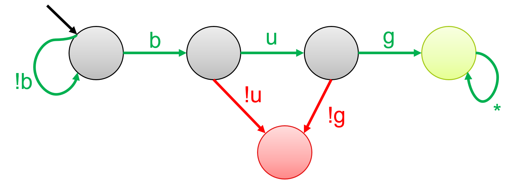
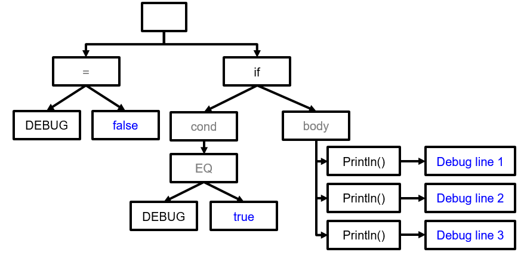

# Static testing

Static testing analyses the code characteristics without executing the application. It can be considered as an automated code review. It checks the style and structure of the code, and can be used to _statically_ evaluate all possible code paths in the System Under Test (SUT).
Static analysis can quickly find _low-hanging fruit_ bugs that can be found in the source code, e.g. using deprecated functions. Static analysis tools are scalable and generally require less time to set up. _PMD_, _Checkstyle_, _Checkmarx_ are some common static analysis tools.

The classical approach underlying static analysis is checking the code for potential structural and/or stylistic rule violations. A code checker typically contains a parser and an acceptable rule set. We look at the following techniques for static analysis:

1. Pattern matching via *Regular expressions*
2. Syntax analysis via *Abstract Syntax Trees*


## Pattern matching

Pattern matching is a code checking approach that searches for pre-defined patterns in code. A **Regular expression** or RegEx is a sequence of characters that represent a pattern. Simply put, a regex engine reads code character-by-character and upon every character-match, progresses through the regular expression until no more characters remain. Depending on the logic, either a positive/negative reaction is returned indicating whether the final state was an accepting/rejecting state, or all code snippets that matched the pattern are returned.

Regular expressions are usually represented using ***Finite State Automaton***. Each _node_ represents a state. We move from one state to the next by taking the _transition_ that matches the input symbol. Below you see a few examples of regular expressions and their corresponding finite state automata. The node with an arrow is called the _starting state_. _Green states_ are accepting states, and _red states_ are rejecting states.

The regular expression that results in the following automata is '**bug**'. An input of the string `bug` will transition from left to right, until we end up in the green state. However, an input of `bag` will move from first state to the second state, and then to the red state. Since there is no transition out of this state, we will stay here until the input finishes.


Regex also have options to introduce wildcard characters. For example, the regular expression '**.*bug**' results in the following automata. `.` denotes any possible character, and `*` denotes *0 or many times*. Hence, the following strings will be accepted by this pattern: `bug` and `this is a bug`. The following strings will be rejected by this pattern: `bug!`, `bugs`, `bad bug`.


The automata for '**.\*bug.\***' is given below. It will accept any string that contains the characters `b`, `u`, `g` consecutively, at least once, before the occurrence of `b`, `u`, or `g` separately.




Regular expressions have some limitations: First, they cannot count, so we need to explicitly program each scenario in the regex, which reduces flexibility. For example, if we wanted to _allow at most 3 methods_, we would need to create a regex with three explicit sub-patterns, one for each function occurrence. Second, regular expressions don't take semantics into account, so they create many false positives. For example, consider the following code snippet. Suppose that the regular expression, `(\s)*System.out.println\(.*\);`, searches for all print statements in the code to remove them before deployment. It will find three occurrences in the code snippet, which are all FPs because the code is already disabled by a flag.

```java
boolean DEBUG = false;

if (DEBUG){
  System.out.println("Debug line 1");
  System.out.println("Debug line 2");
  System.out.println("Debug line 3");
}
```

## Syntax analysis

A more advanced code checking approach is syntax analysis. It works by deconstructing input code into a stream of characters, that are eventually turned into a Parse Tree. _Tokens_ are hierarchal data structures that are put together according to the code's logical structure.


A **Parse Tree** is a concrete instantiation of the code, where each character is explicitly placed in the tree, whereas an **Abstract Syntax Tree (AST)** is an abstract version of the parse tree in which syntax-related characters, such as semi-colon and parentheses, are removed. An example of the AST of the code snippet above is given below.





A static analysis tool using syntax analysis takes as input (a) an AST, and (b) a rule-set, and raises an alarm in case a rule is violated.
For example, for a rule _allowing at most 3 methods_, and the following code snippet, the AST will be parsed and an error will be raised for violating the rule. Contrarily, a very complicated regular expression would be needed to handle the varying characteristics of the four available methods, potentially resulting in false positives.


Abstract Syntax Trees are used by compilers to find sematic errors &mdash; compile-time errors associated to the _meaning_ of the program. ASTs can also be used for program verification, type-checking, and translating the program from one language to another.  

## Performance of static analysis

 Typically, static analysis produces _sound_ results, i.e. zero false negatives. This is because the tools have access to the whole codebase, and they can track all the possible execution paths a program might take. So, if there are _any_ vulnerabilities, the tool should be able to find them. However, this comes at the cost of _Completeness_. Because it tracks all possible execution paths without seeing how the application behaves in action, some of the results might never be reached in an actual execution scenario, resulting in false positives.

 >Note that static analysis _can produce unsound results_ if a piece of code is added at runtime, because then the analysis will not be done on the new code-piece. This is one reason why the signatures that static analysis uses to detect bugs need to be kept up-to-date as the codebase evolves. However, this strategy will still not work for dynamically induced bugs.


 _Soundness_ and _Completeness_ are defined more extensively in the Security testing chapter. 

## Exercises

**Exercise 1.** Regular expressions _CANNOT DO_ which of the following tasks?
1. Matching patterns
2. Count instances
3. Define wild cards
4. Detect coding mistakes

**Exercise 2.** Given that a static analysis tool can view the entire codebase, what is the quality of results that the analysis will produce?
1. Sound and Complete
2. Sound but Incomplete
3. Unsound but Complete
4. Unsound and Incomplete

**Exercise 3.** Create an Abstract Syntax Tree for the following code snippet:
```java
(a + b) * (c - d)
```


## References

* Grune, D., Van Reeuwijk, K., Bal, H.E., Jacobs, C.J. and Langendoen, K., 2012. Modern compiler design. Springer Science & Business Media.
* Abstract Syntax Trees. https://en.wikipedia.org/wiki/Abstract_syntax_tree
* Sematic analysis. https://www.cs.usfca.edu/~galles/cs414S05/lecture/old2/lecture7.java.pdf
* Regular expressions in Java. https://www.tutorialspoint.com/java/java_regular_expressions.htm
